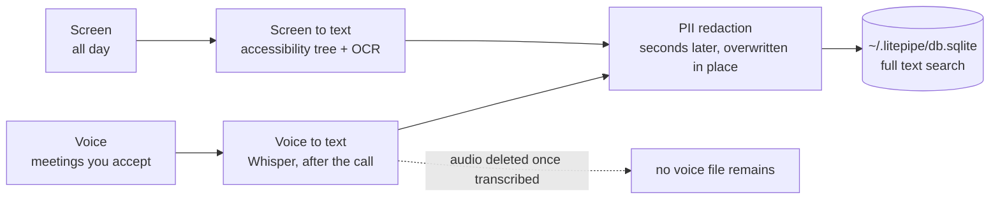
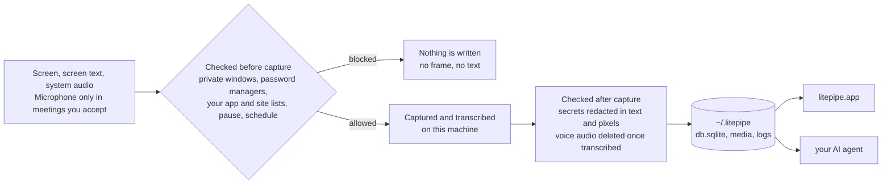

<div align="center">


# litepipe

**A local memory of everything you have seen, said or heard while you work at your computer.**

It remembers your work. It stays on your Mac. It feeds your AI.

[Features](#features) | [Install](#install) | [How it works](#how-it-works) | [Architecture](#architecture) | [FAQ](#faq)

[](LICENSE.md)
[](#install)
[](#status)
[](LICENSE.md)
[](#architecture)

**0 network calls · 100% on device**

</div>

---

<!-- demo GIF goes here: banner "Transcribe this meeting?" appears over a call,
     click Yes, notch panel shows Transcribing meeting, transcript opens at the end.
     Caption: litepipe asks before it records. One click, and the meeting becomes
     a transcript on your disk. -->

All work and no play makes Jack a dull boy.

You work all day and your agents still start from scratch.

litepipe keeps a local memory of everything you do, hear, and see on your
computer: meetings, videos, clicks, every app. It all lands in one folder on
your Mac.

Screenpipe built a solid capture engine and published it under MIT. litepipe is
a fork that keeps that core evolving in the open, without the features that
grew around it: no pipes, no accounts, no telemetry, no cloud sync. The work
goes into simplicity, less weight, and safer guardrails on what gets captured.
Bugs in the shared code go back upstream, as in
[issue 5531](https://github.com/screenpipe/screenpipe/issues/5531) and
[pull request 5532](https://github.com/screenpipe/screenpipe/pull/5532).

## Features

* **Meetings become transcripts.** litepipe spots the call window and asks. One
  click, and the transcript is on your disk when the call ends.
* **The microphone opens only for meetings you accept.** The recording is
  deleted once it's text.
* **Everything on screen is captured.** Text comes from the accessibility tree,
  with OCR for what the tree can't see.
* **Nothing leaves the Mac.** Whisper and pyannote run on device, and the only
  socket is the app talking to its own engine.
* **One folder holds it all.** SQLite with full text search, so your agent reads
  it directly.

## Install

### App

Download [litepipe.dmg](https://rafaelpta.github.io/litepipe/install/?download=1),
drag it to Applications, launch. Signed and notarized by Apple.

### Source

To audit or change the code. Needs Xcode. The engine ships prebuilt;
rebuilding it needs Rust and CMake, see `crates/`.

```bash
git clone https://github.com/Rafaelpta/litepipe
cd litepipe/apps/litepipe-mac
./build-app.sh release
```

### CLI

The engine alone, no app. Captures into `~/.litepipe`, local API on
127.0.0.1:3030, control C stops it. No meeting banner, no microphone gate, and
the permissions go to your terminal.

```bash
curl -fsSL https://raw.githubusercontent.com/Rafaelpta/litepipe/main/headless.sh | bash
```

## How it works

The engine reads what you're working on through the accessibility tree, the
layer assistive technology uses: like HTML, for every app. OCR fills the gaps
the tree can't see: video, games, remote desktops. Voice is transcribed locally
with Whisper and grouped by speaker. Everything lands in SQLite with full text
search, so you can query it, search it, or point your AI agent at the folder
and ask what you agreed to, planned, or missed.

Screen and voice take separate paths, both end as searchable text in the same
database, and everything is redacted before it settles.



| Step | Detail |
|------|--------|
| Capture | Event driven: an app switch, click, scroll stop, or typing pause triggers a screenshot paired with the accessibility tree; idle fallback when nothing happens; audio in 30 second chunks with 2 second overlap |
| Screen to text | The accessibility tree arrives with the frame; OCR fills its gaps seconds behind, in a background queue. Stopping the engine drops whatever is still queued |
| Meetings | Window titles plus browser URLs from captured frames; banner within about 10 seconds of joining, mic on about 3 seconds after you accept |
| Voice to text | Whisper large v3 turbo (quantized, Metal) retranscribes the meeting after the call on audio normalized to -16 LUFS; transcript ready about 11 minutes after the call ends |
| PII redaction | Seconds after each item lands, on this Mac: all text is cleaned, secret regions in screenshots painted black, the original overwritten in place. Voice audio is deleted once transcribed. Details under Privacy controls |
| Cleanup | Voice audio deleted after transcription, within the hour; system audio kept 7 days; frames 30 days; text and index kept |

## Privacy controls

Capture isn't all or nothing. What ships today:

* **Private windows are never captured.** Safari, Chrome, Edge, Brave, Arc, and
  Firefox.
* **Password managers are never captured.** 1Password, Bitwarden, LastPass,
  Dashlane, KeePassXC, and Keychain Access.
* **Any app or site can be excluded.** Settings, Privacy takes two lists, one of
  websites and one of apps. An excluded window never reaches the capture buffer,
  so no frame and no text of it exists.
* **Capture stops when you want.** One shortcut pauses everything, hours can be
  set to a schedule, and DRM video pauses it on its own.
* **Secrets are redacted.** On by default: keys, cards, and passwords become
  labels in text and black boxes in screenshots, and the original is
  overwritten. Under the hood: 46 deterministic patterns run first, an ONNX
  model on the Apple Neural Engine catches what patterns can't, and a second
  model finds secrets in the pixels and paints them solid black rather than
  blurred, since a blur can be undone.
* **What was captured can be deleted.** Settings, Data shows how much litepipe
  holds and deletes the last hour, the last day, a period you pick, or
  everything, files included. The local API does the same for scripts.
* **The whole memory can be locked.** The vault encrypts database and media with
  a key derived from your password, held only on your machine.

## Architecture

Everything runs in two processes on your machine, and what they may write is
checked twice: before capture, and before it settles on disk. Every claim below
can be checked from a shell on your own machine.



| Component | Stack | Role |
|-----------|-------|------|
| litepipe.app | Swift, AppKit, SwiftUI | Notch companion, meeting detection and consent, mic gate, timeline, settings |
| engine | Rust | Screen and audio capture, VAD, transcription, diarization, redaction, SQLite, local HTTP API |

### Processes and permissions

The app spawns the engine with `posix_spawn` and disclaims responsibility
transfer, so it stays the TCC responsible process: the permission prompts and
grants belong to litepipe.app, and one set covers both processes. Kill the app
and the engine goes with it.

macOS permissions used: Screen Recording (capture), Accessibility (screen text
and UI events), Microphone (only while a meeting you accepted is running).

### What's written to disk

Everything lives in one folder, `~/.litepipe`. Browse it with `open ~/.litepipe`.

| Your data | Where it lives |
|-----------|----------------|
| Screen captures, the images | `data/<date>/` as JPEG frames plus one compacted `.mp4` per monitor |
| Screen text read by OCR | `db.sqlite`, table `ocr_text`, one row per captured frame |
| Voice transcripts | `db.sqlite`, table `audio_transcriptions` |
| Meetings and their transcripts | `db.sqlite`, tables `meetings` and `meeting_transcript_segments` |
| Raw audio | `data/<date>/`, one file per device; meeting microphone audio is deleted once transcribed, the text is what remains |
| Keyboard and UI activity | `db.sqlite`, tables `ui_events` and `elements` |
| App and engine logs | `app.log` and `engine-app.log`, lifecycle events only, no captured content |

Nothing is encrypted at rest by default: FileVault covers the disk, and the
vault (`/vault/*`) locks the database and media behind a password when you turn
it on. Settings, Data shows the folder's size and deletes by period, from the
last hour to all of it. Removing `~/.litepipe` by hand works too; the app
rebuilds an empty one on the next launch.

### Network

One listening socket: the engine on `127.0.0.1:3030`, writes authenticated with
a key generated at install time. The app is the only client; it calls
`meetings/start`, `meetings/stop`, `meetings/status`, `audio/start`,
`audio/stop`, and `health`, and reads history straight from SQLite. Confirm with
`lsof -nP -iTCP -sTCP:LISTEN | grep screenpipe` or a network monitor.

Models are downloaded once on first run and then cached: Whisper and a voice
activity model for transcription, and, while secret redaction is on, an image
redactor (52 MB, `~/.screenpipe/models/rfdetr_v12.onnx`) and a text redactor
(159 MB, `~/.screenpipe/models/v45_phase5_pruned/`).

### Source map

| What you want to audit | Where it lives |
|------------------------|----------------|
| Engine spawn, flags, restart, mic gate | `apps/litepipe-mac/Sources/litepipe/Engine.swift` |
| Meeting detection, consent, cleanup | `apps/litepipe-mac/Sources/litepipe/MeetingWatcher.swift`, `MeetingPrompt.swift` |
| Privacy settings and exclusion lists | `apps/litepipe-mac/Sources/litepipe/Settings.swift` |
| Screen capture and window filtering | `crates/screenpipe-screen/`, `crates/screenpipe-capture/` |
| Accessibility text and private window detection | `crates/screenpipe-a11y/` |
| Audio, VAD, transcription | `crates/screenpipe-audio/` |
| Secret redaction, text and image | `crates/screenpipe-redact/` |
| Storage, schema, retention | `crates/screenpipe-db/`, `crates/screenpipe-engine/src/retention.rs` |
| HTTP API and routes | `crates/screenpipe-engine/src/server.rs`, `src/routes/` |

## Specs

| Area | Spec |
|------|------|
| Screen capture | ScreenCaptureKit, event driven: captures when the screen changes, idle fallback when it doesn't; all monitors, every on screen app |
| Screen text | Accessibility tree extraction; OCR fallback for video, games, remote desktops |
| Audio capture | System audio continuous; microphone only during confirmed meetings; 30 second chunks with 2 second overlap |
| Meeting detection | Zoom, Google Meet, Microsoft Teams (native and web), FaceTime; window titles plus browser URLs from captured frames; banner within about 10 seconds |
| Meeting end | Automatic about 30 seconds after the meeting windows disappear; stop button; shortcut |
| Transcription | Whisper large v3 turbo, quantized, Metal; audio normalized to -16 LUFS; full meeting context; transcript about 11 minutes after the call ends |
| Speaker separation | pyannote segmentation and voice embeddings |
| Secret redaction | On by default; 46 deterministic patterns plus ONNX models on the Apple Neural Engine (text and image); labels in text, solid black boxes in screenshots, source overwritten |
| Capture exclusions | Private browser windows, password managers, and the app and domain lists from Settings; excluded windows never reach the capture buffer |
| Storage | SQLite with FTS5 at `~/.litepipe/db.sqlite`; media in `~/.litepipe/data` |
| Retention | Voice audio deleted after transcription, within the hour; system audio 7 days; frames 30 days; text and index kept |
| Local API | REST on 127.0.0.1:3030 with a per install key; the same API the app uses |
| Telemetry | Disabled; the engine logs "telemetry is disabled" at startup |
| Offline | Fully functional without network after the one time model download on first run |
| Diagnostics | Engine lifecycle log at `~/.litepipe/app.log` |
| Distribution | Developer ID, hardened runtime, notarized, stapled DMG (69 MB); installed app 151 MB |
| Platform | macOS on Apple Silicon |
| License | MIT, full source |

## FAQ

**Does any audio or screen data leave my machine?** No. The engine downloads
its models on first run; after that the only network socket is the app talking
to its own engine on 127.0.0.1. No telemetry, no crash reporting, no updater.

**What happens to the recording of my voice?** It's deleted within the hour and
the transcript stays. A voice recording is the most sensitive file on the disk:
minutes of it can clone a voice, and an hour of meetings is about 25 MB of
audio against 50 KB of text.

**Which meeting apps are detected?** Zoom, Google Meet, and Microsoft Teams,
native and web, plus FaceTime. Detection reads window titles and browser URLs
from captured frames.

**How do I keep something out of the memory?** Four ways. Private browser
windows are skipped on their own. Any app or site goes on the ignore list. The
shortcut pauses everything. And anything already captured can be deleted by
period in Settings, Data.

**Is the data encrypted?** FileVault covers the disk, on by default in macOS.
The vault adds a lock on the database and media, behind a key derived from your
password. Transparent encryption during capture is on the roadmap.

**How much disk does it use?** System audio is kept 7 days and screen frames 30
days, both cleaned up on their own. Text and the index stay, and they're small.
Settings, Data shows the current size.

**Can my AI agent read the data?** Yes, that's the point. Plain SQLite and
media files in `~/.litepipe`. Point an agent at the folder and query it.

**How do I delete everything?** Settings, Data, delete all context. Or quit the
app and remove `~/.litepipe`.

## Status

Early beta. Native macOS on Apple Silicon. Open an issue when something breaks.

## Contributing

Bug reports and fixes are welcome. The direction is narrow on purpose: keep it
local, keep it stripped to the basics, and make the capture engine better.

## License

litepipe is MIT. It adapts open source code from Screenpipe and Clicky, both
MIT, and bundles FFmpeg. The notices are in [LICENSE.md](LICENSE.md),
[NOTICE](NOTICE), and
[THIRD_PARTY_NOTICES.md](apps/litepipe-mac/THIRD_PARTY_NOTICES.md).
