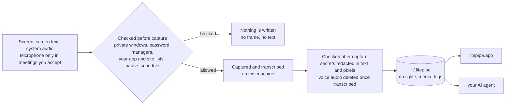

<div align="center">


# litepipe

**Open source local memory.**

It remembers your work. It stays on your Mac. It feeds your AI.

[Features](#features) | [Install](#install) | [How it works](#how-it-works) | [Architecture](#architecture) | [FAQ](#faq)

[](LICENSE.md)
[](#install)
[](#status)
[](NOTICE)

**0 network calls · 100% on device**

</div>

---

<!-- demo GIF goes here: banner "Transcribe this meeting?" appears over a call,
     click Yes, notch panel shows Transcribing meeting, transcript opens at the end.
     Caption: litepipe asks before it records. One click, and the meeting becomes
     a transcript on your disk. -->

All work and no play makes Jack a dull boy.

It's insane that you work all day and your agents still start from scratch, with
no idea what you've been doing.

litepipe keeps a local memory of everything you do, hear, and see on your
computer: the videos you watch, the meetings you join, the clicks and the work
across your apps, and stores it in one folder on your Mac.

litepipe is fully local. The only network socket in litepipe is the app talking
to its own engine on 127.0.0.1.

Screenpipe built foundations for a solid capture engine, published under MIT.

litepipe is a fork that exists to keep the core of the capture engine evolving
in the open. The features that grew around it are not here (pipes, accounts,
telemetry, and cloud sync, etc). All the work goes into more simplicity, less
weight, and safer guardrails on what the engine captures.

Bugs in the shared code go back upstream, as in
[issue 5531](https://github.com/screenpipe/screenpipe/issues/5531) and
[pull request 5532](https://github.com/screenpipe/screenpipe/pull/5532).

## Features

* **Meetings become transcripts.** litepipe spots the call window and asks. One
  click, and the transcript is on your disk when the call ends.
* **The microphone opens only for meetings you accept.** The recording is
  deleted once it has become text.
* **Everything on screen is captured.** Text comes from the accessibility tree,
  the layer assistive technology reads, with OCR for what the tree cannot see.
* **Nothing leaves the Mac.** Whisper and pyannote run on device, and the only
  socket is the app talking to its own engine.
* **One folder holds it all.** SQLite with full text search, so your agent reads
  it directly.

## Install

The recommended way, one line, no clone, no build:

```bash
curl -fsSL https://raw.githubusercontent.com/Rafaelpta/litepipe/main/install.sh | bash
```

It downloads the latest DMG, signed and notarized by Apple, verifies it with
Gatekeeper and refuses to install if the check fails, copies the app to
`/Applications`, and opens it. First launch walks you through the macOS
permissions, granted to litepipe itself, exactly as if you had installed by
hand. Prefer to do it by hand? Grab the DMG from
[releases](https://github.com/Rafaelpta/litepipe/releases) and drag it to
Applications. Same result.

The other two paths are for developers.

**Build from source**, to audit or change the code. Needs Xcode:

```bash
git clone https://github.com/Rafaelpta/litepipe
cd litepipe/apps/litepipe-mac
./build-app.sh release
```

The capture engine ships prebuilt inside the app bundle; rebuilding it needs
Rust and CMake, see the engine crate under `crates/`.

**Headless**, the engine alone with no app installed, if you only want the
memory and none of the interface:

```bash
curl -fsSL https://raw.githubusercontent.com/Rafaelpta/litepipe/main/headless.sh | bash
```

It captures into `~/.litepipe` and serves the local API, and stops with control
C. You give up what the app adds: the meeting banner, the microphone gate, the
privacy settings, and the pause shortcut. macOS also attributes the permissions
to your terminal rather than to litepipe, so it is not the path to hand to
someone else.

## How it works

The engine reads the text of whatever you are working on through the
accessibility tree, the layer assistive technology uses: like HTML, for every
app. OCR fills the gaps the tree cannot see, such as video, games, and remote
desktops. Audio goes through voice activity detection, is transcribed locally
with Whisper, and grouped by speaker. Everything lands in SQLite with full text
search.

The result is your work in a form software can use: query it, search it, or
point your AI agent at the folder and ask what you agreed to, planned, or
missed.

| Step | Detail |
|------|--------|
| Meeting detection | Window titles plus browser URLs from captured frames; banner within about 10 seconds of joining, mic on about 3 seconds after you accept |
| Capture | Event driven: an app switch, click, scroll stop, or typing pause triggers a screenshot paired with the accessibility tree; idle fallback when nothing happens; audio in 30 second chunks with 2 second overlap |
| Transcription | Whisper large v3 turbo (quantized, Metal) retranscribes the meeting after the call on audio normalized to -16 LUFS; transcript ready about 11 minutes after the call ends |
| Cleanup | Voice audio deleted after transcription, within the hour; system audio kept 7 days; frames 30 days; text and index kept |

## Privacy controls

Capture is not all or nothing. What ships today:

* **Private windows are never captured.** Safari, Chrome, Edge, Brave, Arc, and
  Firefox, with nothing to configure.
* **Password managers are never captured.** 1Password, Bitwarden, LastPass,
  Dashlane, KeePassXC, and Keychain Access.
* **Any app or site can be excluded.** Settings, Privacy takes two lists, one of
  websites and one of apps. An excluded window never reaches the capture buffer,
  so no frame and no text of it exists.
* **Capture stops when you want.** One shortcut pauses everything, hours can be
  restricted to a schedule, and DRM video pauses it on its own.
* **Secrets are redacted.** On by default: keys, cards, and passwords become
  labels in text and black boxes in screenshots, and the original is
  overwritten. Under the hood: 46 deterministic patterns run first (credit
  cards, private keys, database URLs carrying credentials, API keys for Stripe,
  OpenAI, Anthropic, Google, GitHub and more), an ONNX model on the Apple Neural
  Engine catches what patterns cannot, and a second model finds secrets in the
  pixels and paints those regions solid black rather than blurred, since a blur
  can be undone.
* **What was captured can be deleted.** Settings, Data shows how much litepipe
  holds on this Mac and deletes the last hour, the last day, a period you pick,
  or everything, files included. The local API does the same for scripts.
* **The whole memory can be locked.** The vault encrypts database and media with
  a key derived from your password, held only on your machine.

## Architecture

Everything runs in two processes on your machine, and what they may write is
checked twice: once before anything is captured, and once before it settles on
disk. Every claim below is verifiable from a shell on your own machine.



| Component | Stack | Role |
|-----------|-------|------|
| litepipe.app | Swift, AppKit, SwiftUI | Notch companion, meeting detection and consent, mic gate, timeline, settings |
| engine | Rust | Screen and audio capture, VAD, transcription, diarization, redaction, SQLite, local HTTP API |

### Processes and permissions

The app spawns the engine with `posix_spawn` and disclaims responsibility
transfer, so it stays the TCC responsible process: the permission prompts and
grants belong to litepipe.app, and one set covers both processes. Kill the app
and the engine goes with it.

macOS permissions used: Screen Recording (capture), Accessibility (screen text
and UI events), Microphone (only while a meeting you accepted is running).

### What is written to disk

| Path | Contents |
|------|----------|
| `~/.litepipe/db.sqlite` | `frames`, `ocr_text`, `elements`, `ui_events`, `audio_chunks`, `audio_transcriptions`, `speakers`, `meetings`, `tags`, plus FTS5 indexes |
| `~/.litepipe/data/<date>/` | JPEG frames, compacted `.mp4` per monitor, audio chunks per device |
| `~/.litepipe/app.log` | App and engine lifecycle: spawn, exit, pause, meeting start and stop |
| `~/.litepipe/engine-app.log` | Engine stdout and stderr |

Nothing is encrypted at rest by default; FileVault covers the disk, and the
vault (`/vault/*`) locks the database and media behind a password when you turn
it on.

Settings, Data reports the size of that folder and deletes from it: the last
hour, the last day, a period you choose, or all of it. Removing `~/.litepipe`
by hand does the same thing, and the app rebuilds an empty one on the next
launch.

### Network

One listening socket: the engine on `127.0.0.1:3030`, writes authenticated with
a key generated at install time. The app is the only client; it calls
`meetings/start`, `meetings/stop`, `meetings/status`, `audio/start`,
`audio/stop`, and `health`, and reads history straight from SQLite. Confirm with
`lsof -nP -iTCP -sTCP:LISTEN | grep screenpipe` or a network monitor.

Models are downloaded once on first run and then cached: Whisper and a voice
activity model for transcription, and, while secret redaction is on, an image
redactor (52 MB, `~/.screenpipe/models/rfdetr_v12.onnx`) and a text redactor
(159 MB, `~/.screenpipe/models/v45_phase5_pruned/`).

### Source map

| What you want to audit | Where it lives |
|------------------------|----------------|
| Engine spawn, flags, restart, mic gate | `apps/litepipe-mac/Sources/litepipe/Engine.swift` |
| Meeting detection, consent, cleanup | `apps/litepipe-mac/Sources/litepipe/MeetingWatcher.swift`, `MeetingPrompt.swift` |
| Privacy settings and exclusion lists | `apps/litepipe-mac/Sources/litepipe/Settings.swift` |
| Screen capture and window filtering | `crates/screenpipe-screen/`, `crates/screenpipe-capture/` |
| Accessibility text and private window detection | `crates/screenpipe-a11y/` |
| Audio, VAD, transcription | `crates/screenpipe-audio/` |
| Secret redaction, text and image | `crates/screenpipe-redact/` |
| Storage, schema, retention | `crates/screenpipe-db/`, `crates/screenpipe-engine/src/retention.rs` |
| HTTP API and routes | `crates/screenpipe-engine/src/server.rs`, `src/routes/` |

## Specs

| Area | Spec |
|------|------|
| Screen capture | ScreenCaptureKit, event driven: captures when the screen changes, idle fallback when it does not; all monitors, every on screen app |
| Screen text | Accessibility tree extraction; OCR fallback for video, games, remote desktops |
| Audio capture | System audio continuous; microphone only during confirmed meetings; 30 second chunks with 2 second overlap |
| Meeting detection | Zoom, Google Meet, Microsoft Teams (native and web), FaceTime; window titles plus browser URLs from captured frames; banner within about 10 seconds |
| Meeting end | Automatic about 30 seconds after the meeting windows disappear; stop button; shortcut |
| Transcription | Whisper large v3 turbo, quantized, Metal; audio normalized to -16 LUFS; full meeting context; transcript about 11 minutes after the call ends |
| Speaker separation | pyannote segmentation and voice embeddings |
| Secret redaction | On by default; 46 deterministic patterns plus ONNX models on the Apple Neural Engine (text and image); labels in text, solid black boxes in screenshots, source overwritten |
| Capture exclusions | Private browser windows, password managers, and the app and domain lists from Settings; excluded windows never reach the capture buffer |
| Storage | SQLite with FTS5 at `~/.litepipe/db.sqlite`; media in `~/.litepipe/data` |
| Retention | Voice audio deleted after transcription, within the hour; system audio 7 days; frames 30 days; text and index kept |
| Local API | REST on 127.0.0.1:3030 with a per install key; the same API the app uses |
| Telemetry | Disabled; the engine logs "telemetry is disabled" at startup |
| Offline | Fully functional without network after the one time model download on first run |
| Diagnostics | Engine lifecycle log at `~/.litepipe/app.log` |
| Distribution | Developer ID, hardened runtime, notarized, stapled DMG (69 MB); installed app 151 MB |
| Platform | macOS on Apple Silicon |
| License | MIT, full source |

## FAQ

**Does any audio or screen data leave my machine?** No. On first run the engine
downloads its models, Whisper and a voice activity model, plus two redaction
models while secret redaction is on. After that the only network socket is the
app talking to its own engine on 127.0.0.1. No telemetry, no crash reporting, no
updater.

**What happens to the recording of my voice?** Deleted on the next cleanup pass,
within the hour, and the transcript stays. A voice recording is the most
sensitive file on the disk, minutes of it are enough to clone a voice, and the
largest: an hour of meetings is about 25 MB of audio against 50 KB of text.

**Which meeting apps are detected?** Zoom, Google Meet, and Microsoft Teams,
native and web, plus FaceTime. Detection reads window titles and the browser
URLs already in captured frames.

**How do I keep something out of the memory?** Four ways. Private browser
windows are skipped on their own. Any app or site goes on the ignore list in
Settings, Privacy. The shortcut pauses everything instantly. And what was
captured anyway can be deleted by period in Settings, Data.

**Is the data encrypted?** FileVault covers the disk, which macOS enables by
default. On top of that the vault locks the database and media behind a key
derived from your password, held only on your machine. Transparent encryption
during capture is on the roadmap.

**How much disk does it use?** System audio is kept 7 days and screen frames 30
days, both reclaimed automatically. Text and the search index stay, and they are
small. Settings, Data shows the current size.

**Can my AI agent read the data?** Yes, that is the point. Plain SQLite and
media files in `~/.litepipe`. Point an agent at the folder and query it.

**How do I delete everything?** Settings, Data, delete all context. Or quit the
app and remove `~/.litepipe`.

## Status

Early beta. Native macOS on Apple Silicon. Open an issue when something breaks.

## Contributing

Bug reports and fixes are welcome. The direction is narrow on purpose: keep it
local, keep it stripped to the basics, and make the capture engine better.

## License

litepipe is MIT. It adapts open source code from Screenpipe and Clicky, both
MIT, and bundles FFmpeg. The notices are in [LICENSE.md](LICENSE.md),
[NOTICE](NOTICE), and
[THIRD_PARTY_NOTICES.md](apps/litepipe-mac/THIRD_PARTY_NOTICES.md).
